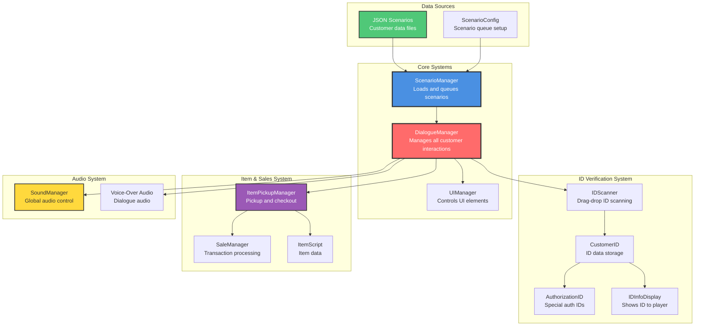
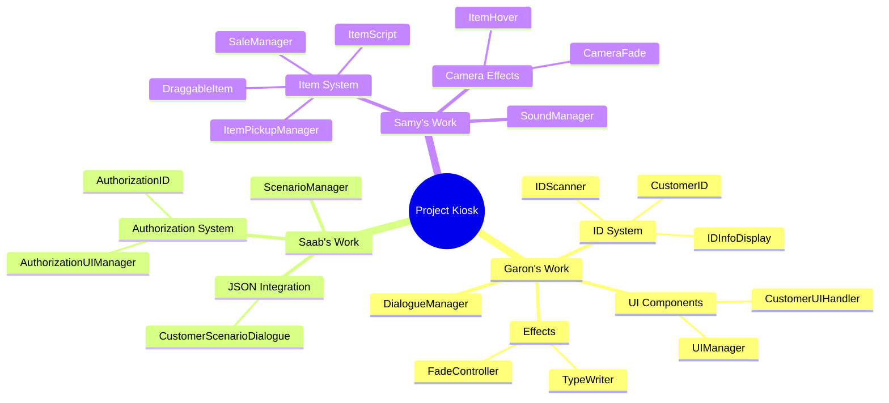
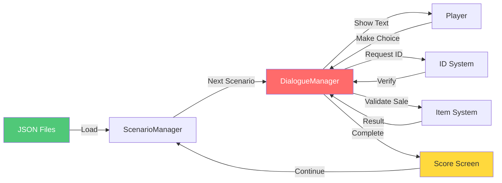
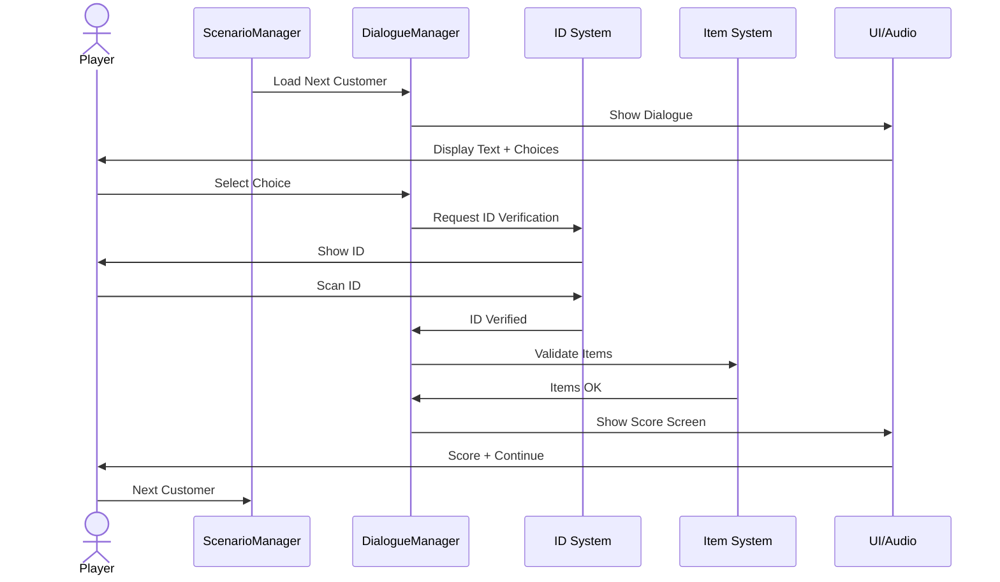

# Project Kiosk - Simple Architecture Overview

A clean, high-level view of the game's architecture for quick reference.

---

## Main System Architecture

---

## Class Organization by Team

---

## Data Flow - Simplified

---

## Key Components Summary

| Component | Type | Purpose | Team Member |
|-----------|------|---------|-------------|
| **DialogueManager** | MonoBehaviour | Core dialogue and customer interaction manager | Garon |
| **ScenarioManager** | MonoBehaviour | Loads and queues customer scenarios | Saab |
| **CustomerID** | MonoBehaviour | Stores and manages ID card data | Garon |
| **AuthorizationID** | MonoBehaviour (inherits CustomerID) | Special ID with authorization check | Saab |
| **ItemPickupManager** | MonoBehaviour | Handles item pickup and checkout zone | Samy |
| **SoundManager** | Singleton | Global audio management | Samy |
| **IDScanner** | MonoBehaviour | Drag-and-drop ID scanning mechanics | Garon |
| **UIManager** | MonoBehaviour | Controls UI elements and panels | Garon |

---

## System Interactions - Quick Reference

---

## Color Legend

- 🔴 **Red (DialogueManager)** - Core system, central to all interactions
- 🔵 **Blue (ScenarioManager)** - Scenario loading and management
- 🟢 **Green (Data/JSON)** - Data sources and configuration
- 🟡 **Yellow (Audio)** - Sound and voice-over systems
- 🟣 **Purple (Items)** - Item and sales systems

---

**Quick View:** This simplified architecture shows the main components without implementation details.
**Full Details:** See `PROJECT_DIAGRAMS.md` for complete system diagrams.
**Documentation:** See `PROJECT_DOCUMENTATION.md` for comprehensive text documentation.

**Created:** 2025-11-25
**Version:** 1.0
