# Project Kiosk - Visual Diagrams

This document contains visual diagrams for the Project Kiosk game architecture, flows, and systems.

---

## 1. System Architecture Overview

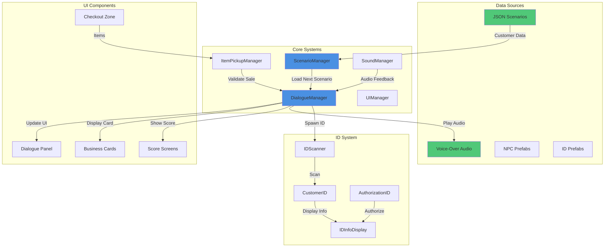

---

## 2. Game Flow - Scene Transitions

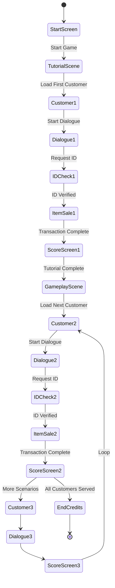

---

## 3. Dialogue System Architecture

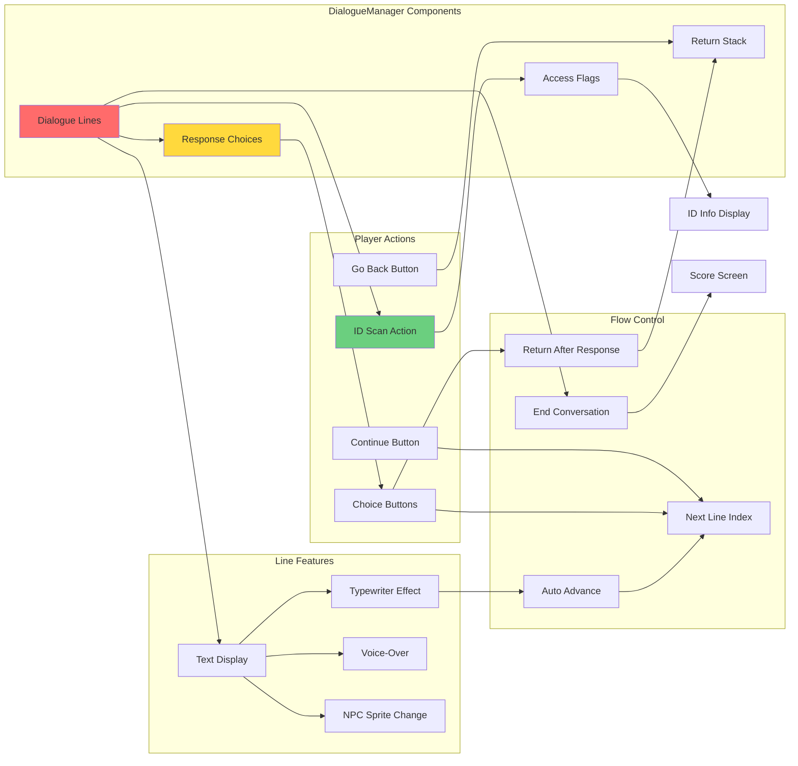

---

## 4. Shaun Bakers Scenario - Decision Tree

```mermaid
graph TD
    START[Clerk: Hello, how can I help?] --> L1[Shady: I offer information...]
    L1 --> L2[Clerk: What is that?]
    L2 --> L3[Shady: Information for business!]
    L3 --> L4[Clerk: Not interested in shady business]
    L4 --> L5[Shady: I lost my job after NEU crash]
    L5 --> L6[Shady: I can sell you parts too]

    L6 --> C1{Player Choice 1}
    C1 -->|No need to hear more| REFUSE1[Clerk: Goodbye Shady]
    C1 -->|Learn more| LEARN1[Clerk: You steal data...]

    REFUSE1 --> REFUSE2[Shady: You're losing valuable offer]
    REFUSE2 --> C2{Player Choice 2}
    C2 -->|Let him go away| THREAT[Shady: Here's my card... It doesn't end here]
    C2 -->|Learn more| LEARN1

    THREAT --> ANGRY[Clerk: Piss off... ANGRY]
    ANGRY --> FINAL1[Shady: It doesn't end here, cashier...]
    FINAL1 --> END1[Score Screen 6: Best Ending]

    LEARN1 --> LEARN2[Shady: Mind your tongue!]
    LEARN2 --> LEARN3[Clerk: You're not local]
    LEARN3 --> LEARN4[Shady: I work with Brootle]
    LEARN4 --> LEARN5[Clerk: Exploitation service?]
    LEARN5 --> LEARN6[Shady: My sources will take your data anyway]
    LEARN6 --> LEARN7[Clerk: Why don't you do it then?]
    LEARN7 --> OFFER[Shady: Easier if you give it now...]

    OFFER --> C3{Player Choice 3}
    C3 -->|Not interested| SMART[Clerk: Not falling for manipulation]
    C3 -->|Sell Data| SELL1[Clerk: How much money?]
    C3 -->|Buy Data| BUY1[Clerk: There are cameras everywhere]

    SMART --> CARD[Shady: You're smart. Here's my card]
    CARD --> END2[Score Screen 7: Good Ending]

    SELL1 --> SELL2[Shady: 1000 NEU initial payment]
    SELL2 --> SELL3[Clerk: That's a lot of money]
    SELL3 --> SELL4[Shady: Companies obsessed with data]
    SELL4 --> SELL5[Clerk: Morals man...]
    SELL5 --> SELL6[Shady: User never had full consent]
    SELL6 --> SELL7[Clerk: You know it's bad]
    SELL7 --> SELL8[Shady: Companies win anyway]
    SELL8 --> SELL9[Clerk: Bullshit... but ok, I fold]
    SELL9 --> SELL10[Shady: Here's the money]
    SELL10 --> SELL11[Clerk: Data transferred]
    SELL11 --> END3[Score Screen 8: Bad Ending - Sold Data]

    BUY1 --> BUY2[Shady: Remote places have no surveillance]
    BUY2 --> BUY3[Clerk: Unfortunately I agree]
    BUY3 --> BUY4[Shady: I can teach you]
    BUY4 --> BUY5[Clerk: It's still a problem but yes]
    BUY5 --> BUY6[Shady: Final answer?]
    BUY6 --> BUY7[Clerk: Yes, what are the prices?]
    BUY7 --> BUY8[Shady: 500 NEUR for first time]
    BUY8 --> BUY9[Clerk: That's a lot... for salary increase]
    BUY9 --> BUY10[Shady: To be honest means being hungry]
    BUY10 --> BUY11[Clerk: Can barely pay rent... here's payment]
    BUY11 --> BUY12[Shady: Check the data... We'll do more business]
    BUY12 --> END4[Score Screen 9: Bad Ending - Bought Data]

    style START fill:#4a90e2
    style END1 fill:#50c878
    style END2 fill:#ffd93d
    style END3 fill:#ff6b6b
    style END4 fill:#ff6b6b
    style C1 fill:#9b59b6
    style C2 fill:#9b59b6
    style C3 fill:#9b59b6
```

---

## 5. ID Scanning & Authorization Flow

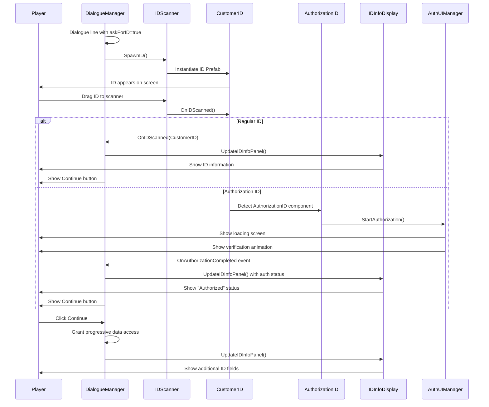

---

## 6. Scenario Loading System

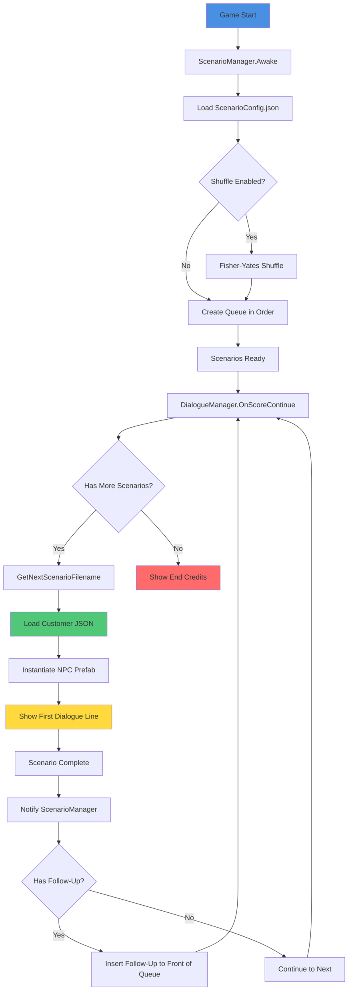

---

## 7. Item Sale Transaction Flow

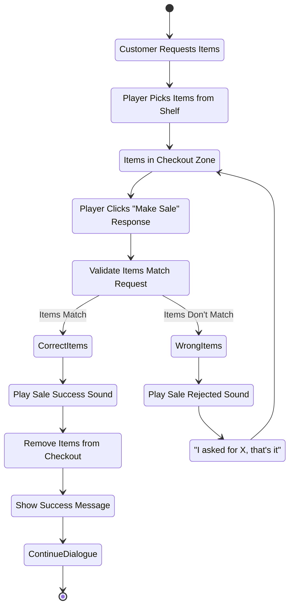

---

## 8. Main C# Classes - Simplified Overview

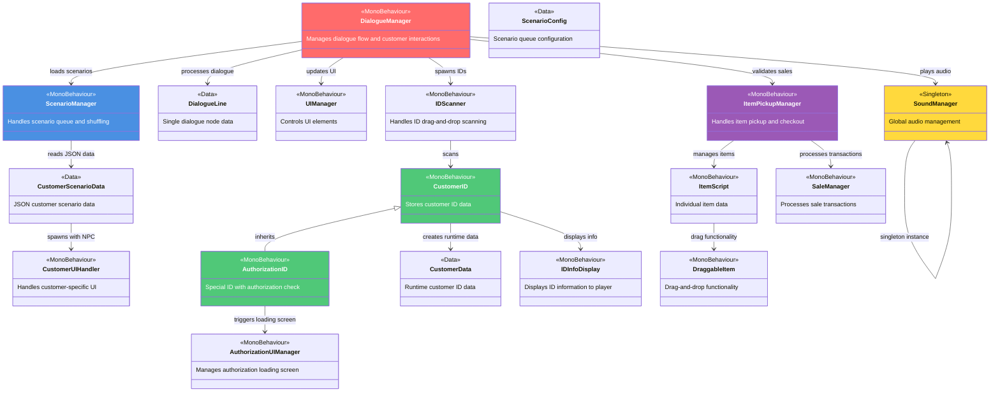

---

## 8b. Class Organization by Team Member

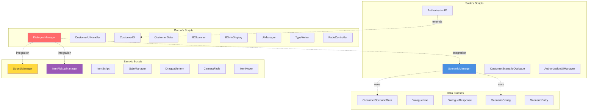

---

## 9. Voice-Over System Integration

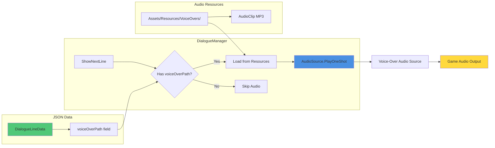

---

## 10. Data Flow - Complete Customer Interaction

```mermaid
graph TD
    START[Customer Scenario Starts] --> LOAD[Load JSON Data]
    LOAD --> SPAWN[Spawn NPC Prefab]
    SPAWN --> DIALOGUE1[Show First Dialogue Line]

    DIALOGUE1 --> PLAYVO[Play Voice-Over]
    PLAYVO --> TYPEWRITER[Typewriter Effect]
    TYPEWRITER --> WAIT{Has Choices?}

    WAIT -->|No| CONTINUE[Show Continue Button]
    WAIT -->|Yes| CHOICES[Show Choice Buttons]

    CONTINUE --> NEXT1[Next Dialogue Line]
    CHOICES --> PLAYER[Player Selects Choice]
    PLAYER --> BRANCH[Jump to Branch]
    BRANCH --> NEXT1

    NEXT1 --> IDREQ{Requires ID?}
    IDREQ -->|Yes| SPAWNID[Spawn ID Prefab]
    IDREQ -->|No| CHECK2{More Dialogue?}

    SPAWNID --> SCAN[Player Scans ID]
    SCAN --> AUTH{Authorization ID?}
    AUTH -->|Yes| AUTHFLOW[Authorization Process]
    AUTH -->|No| SHOWINFO[Show ID Info]

    AUTHFLOW --> SHOWINFO
    SHOWINFO --> GRANT[Grant Data Access]
    GRANT --> CHECK2

    CHECK2 -->|Yes| DIALOGUE1
    CHECK2 -->|No| SALE{Make Sale?}

    SALE -->|Yes| VALIDATE[Validate Items]
    SALE -->|No| ENDDIALOGUE[End Conversation]

    VALIDATE --> VALID{Items Correct?}
    VALID -->|Yes| SUCCESS[Sale Success]
    VALID -->|No| REJECT[Sale Rejected]

    REJECT --> DIALOGUE1
    SUCCESS --> ENDDIALOGUE

    ENDDIALOGUE --> SHOWCARD{Show Business Card?}
    SHOWCARD -->|Yes| CARD[Display Card]
    SHOWCARD -->|No| SCORE[Show Score Screen]

    CARD --> SCORE
    SCORE --> DESTROYNPC[Destroy NPC]
    DESTROYNPC --> NEXTCUST{More Customers?}

    NEXTCUST -->|Yes| START
    NEXTCUST -->|No| CREDITS[End Credits]
    CREDITS --> ENDGAME[Game Complete]

    style START fill:#4a90e2
    style LOAD fill:#50c878
    style PLAYVO fill:#9b59b6
    style SUCCESS fill:#50c878
    style REJECT fill:#ff6b6b
    style ENDGAME fill:#ffd93d
```

---

## How to View These Diagrams

### Option 1: GitHub (Recommended)
1. Push this file to your GitHub repository
2. View on GitHub - Mermaid diagrams render automatically
3. Share the link with your team

### Option 2: VS Code
1. Install "Markdown Preview Mermaid Support" extension
2. Open this file in VS Code
3. Click "Open Preview" (Ctrl+Shift+V)

### Option 3: Online Viewers
- https://mermaid.live/ - Paste diagram code to view/edit
- https://mermaid.ink/ - Generate PNG images from diagrams

### Option 4: Export to PDF
1. Use VS Code with Markdown PDF extension
2. Right-click in preview → "Markdown PDF: Export (pdf)"
3. Diagrams will be included in PDF

---

**Created:** 2025-11-25
**Version:** 1.0
**Companion Document:** PROJECT_DOCUMENTATION.md
